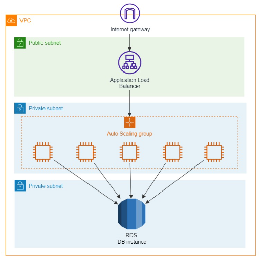

# ALB Architectures

## Question and Answer

Question:
A solutions architect is designing a three-tier website that will be hosted on an Amazon EC2 Auto Scaling group fronted by an Internet-facing Application Load Balancer (ALB). The website will persist data to an Amazon Aurora Serverless DB cluster, which will also be used for generating monthly reports.

The company requires a network topology that follows a layered approach to reduce the impact of misconfigured security groups or network access lists. Web filtering must also be enabled to automatically stop traffic to known malicious URLs and to immediately drop requests coming from blacklisted fully qualified domain names (FQDNs).

Which network topology provides the minimum resources needed for the website to work?

Answer:
Setup a ALB deployed in a public subnet, then host the ASG and EC2 instance and Aurora Serverless DB cluster in a private subnets. Launch a AWS Network Firewall with the appropriate firewall policy to automatically stop traffic to known malicious URLs and drop requests coming from blacklisted FQDNs.  Reroute your Amazon VPC network traffic through the firewall endpoints

## References

https://tutorialsdojo.com/amazon-elastic-compute-cloud-amazon-ec2/

https://tutorialsdojo.com/aws-elastic-load-balancing-elb/

https://tutorialsdojo.com/amazon-aurora/

https://wa.aws.amazon.com/wellarchitected/2020-07-02T19-33-23/wat.pillar.security.en.html

https://docs.aws.amazon.com/wellarchitected/latest/security-pillar/protecting-networks.html

https://docs.aws.amazon.com/network-firewall/latest/developerguide/stateful-rule-groups-domain-names.html
