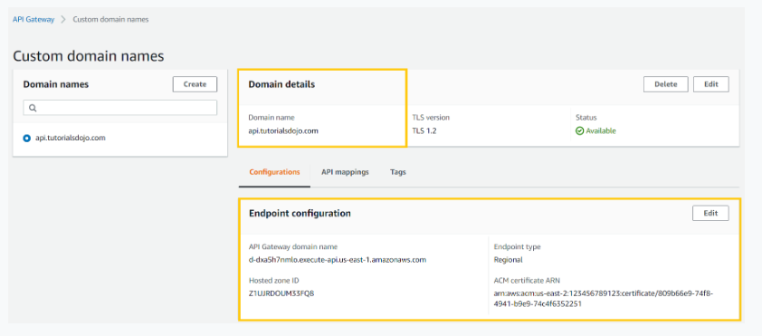

# Amazon API Gateway

## Regional Endpoints types
- A regional API is an API deployed to a specific region and intended to service clients, such as EC2 instances, in the same AWS Region
- API requests are targeted directly to the Region-specific API Gateway API without going through a CloudFront distribution
- Public certificates for your custom domain names of the regional API Gateway must be obtained from the AWS Certificate Manager (ACM) in the same region where the API is deployed

## References

https://aws.amazon.com/api-gateway/faqs/

Check out this Amazon API Gateway Cheat Sheet:

https://tutorialsdojo.com/amazon-api-gateway/

Here is an in-depth tutorial on Amazon API Gateway:

https://youtu.be/XwfpPEFHKtQ