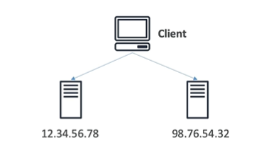

# Global users for our application

- You have deployed an application and have global users who want to access it directly
- They go over the public internet, which can add a lot of latency due to many hops
- We wish to go as far as possible in the network before going over the public internet

- Leverages the AWS internal network to route to your application
- 2 Anycast IP addresses are created for your application
- The Anycast IP send traffic directly to the nearest edge location

- Works with Elastic IP, EC2 instances, ALB, NLB, public and private
- Consistent performance and availability
    - Intelligent routing to lowest latency and fast regional failover
    - No issue with client cache (because the IP does not change)
- Health Checks
  - Global Accelerator performs health checks on your application endpoints every 30 seconds
  - Helps make your application global (failover less than 1 minute)
  - Great for disaster recovery (thanks to health checks)

- Security 
    - only 2 external IP need to be whitelisted
    - DDoS protection thanks to AWS Shield

- Global Accelerator uses Anycast IP addresses which are announced from multiple AWS edge locations
- Unicast IP addresses are announced from a single edge location

