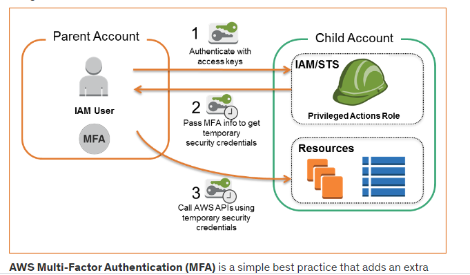

# AWS Identity and Access Management

- Associate IAM roles to EC2 instances to delegate permissions to applications running on the EC2 instances

## References

https://tutorialsdojo.com/aws-identity-and-access-management-iam/

https://aws.amazon.com/iam/details/mfa/

https://docs.aws.amazon.com/AWSEC2/latest/UserGuide/iam-roles-for-amazon-ec2.html