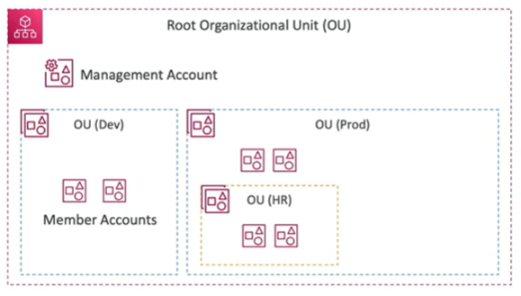
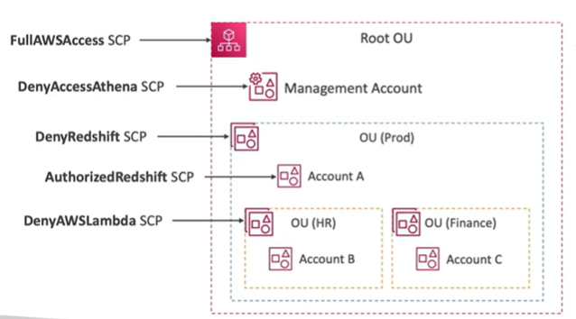

# AWS Organizations

- Global Service
- Allow to manage multiple AWS accounts
- The main account is called the management or master account
- The other accounts are called member accounts
- Member accounts can only be part of one organization
- Consolidated billing across all accounts - single payment method
- Pricing benefits from aggregated usage (volume discount for EC2, S3, etc.)
- Shared reserved  instances and Savings Plans discounts across accounts
- API available to automate AWS account creation
- Service Control Policies (SCP) to centrally control AWS service usage across accounts

- Advantages of using AWS Organizations:
    - Centralized management of multiple AWS accounts
    - Use tagging standards for billing purposes
    - Enable CloudTrail on all accounts, send logs to central S3 account
    - Send CloudWatch Logs to central logging account
    - Establish Cross Account IAM Roles for Admin purposes
    - Security Control Policies can be applied

## AWS Organizations - Security Control Policies

Security: Security Control Policies (SCP)
    - IAM policies applied to OU or account to restrict Users and Roles
    - They do not apply to the management account (full admin power)
    - Must have explicit allow (does not allow anything by default - like IAM)

Example: 

- Management Account
    - Can do anything
    - Can't have SCPs applied to it

- Account A
    - Can do anything
    - EXCEPT access Redshift (explicit deny from OU (Prod)

- Account B
    - Can do anything
    - EXCEPT acceshs Redshift (explicit deny from OU (Prod))
    - EXCEPT access Lambda (explicit deny from OU (HR))

- Account C
    - Can do anything
    - EXCEPT access Redshift (explicit deny from OU (Prod))

