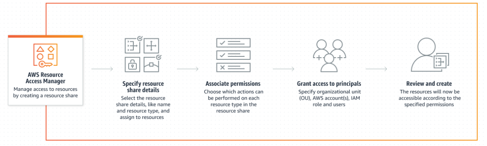

# AWS Resource Access Manager (RAM)

- Enables you to easily and securely share AWS resources with any AWS account or within your AWS Organization.
- You can share AWS Transit Gateways, Subnets, AWS License Manager configurations, and Amazon Route 53 Resolver rules resources with RAM.

- RAM eliminates the need to create duplicate resources in multiple accounts and manage the resources separately.
- This reduces the operational overhead involved in managing resources in different accounts and improves resource utilization.

Steps to share resources with RAM:
1. Create a resource share
2. Specify the resources to share
3. Choose which actions can be performed on each resource type in the resource share
4. Specify the organizational units, AWS account(s), IAM roles to grant access to the resources
5. Review and create

