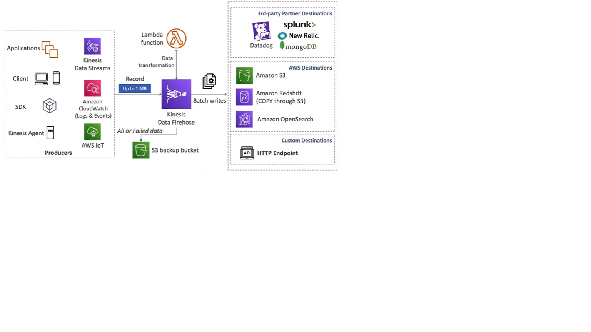

# AWS Kinesis Firehose

- Fully managed service, no administration, automatic scaling, serverless
    - AWS Destination: S3, Redshift, OpenSearch Service
    - 3rd Party Partner: Splunk/MongoDB/Datadog/New Relic
    - Custom: HTTP Endpoint

- Pay for data going through Firehose
- **Near Real Time**
    - 60 seconds latency for non full batches
    - Or minimum 1 MB of data at a time
- Supports many data formats, conversions, transformations, compression
- Supports custom data transformation with Lambda

Producers
- Kinesis Data Streams
- Amazon CloudWatch Logs & Events
- AWS IoT
- Apps, Clients, SDK, Kinesis Agent

Firehose
- Record up to 1 MB
- Use Lambda to transform data
- Batch writes to Destinations

Destinations
- AWS Destinations
    - S3
    - Redshift (Copy through S3)
    - Amazon OpenSearch Service
- 3rd Party Destinations
    - Splunk
    - New Relic
    - MongoDB
    - Datadog
- Custom Destinations
    - HTTP Endpoint