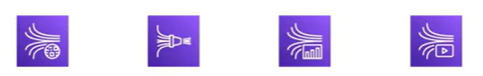

# AWS Kinesis Overview

- Makes it easy to collect, process, and analyze real-time, streaming data in real-time
- Ingest real-time data such as: Application logs, Metrics, Website clickstreams, IoT telemetry data, and more

4 services:
- Kinesis Data Streams: capture, process, and store data streams
- Kinesis Data Firehose: load streams into AWS data stores
- Kinesis Data Analytics: analyze streams with SQL or Apache Flink
- Kinesis Video Streams: capture, process, and store video streams

## References

https://tutorialsdojo.com/amazon-kinesis/

