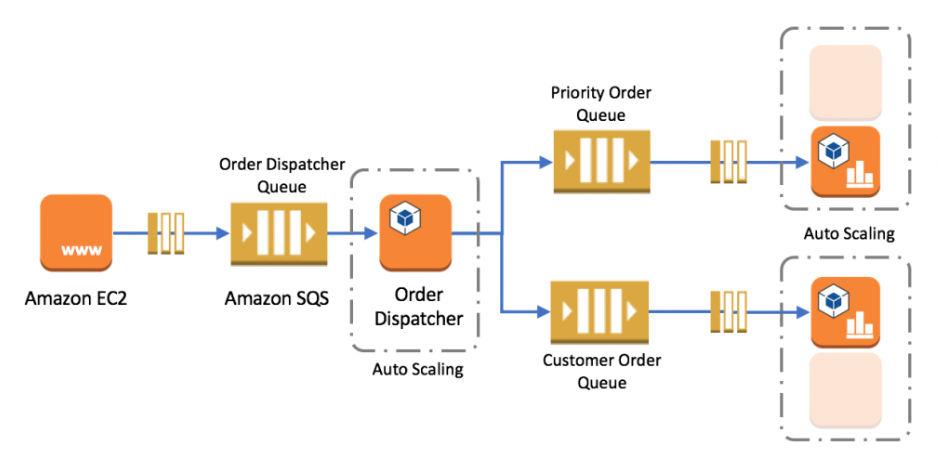

# AWS Simple Queue Service (SQS)

## References
https://tutorialsdojo.com/amazon-sqs/

https://docs.aws.amazon.com/AWSSimpleQueueService/latest/SQSDeveloperGuide/sqs-best-practices.html

## Question & Answer

### Question 1
A company launched a website that accepts high-quality photos and turns them into a downloadable video montage. The website offers a free and a premium account that guarantees faster processing. All requests by both free and premium members go through a single SQS queue and then processed by a group of EC2 instances that generate the videos. The company needs to ensure that the premium users who paid for the service have higher priority than the free members.

How should the company re-design its architecture to address this requirement?

- A. Create two SQS queues: one for free members and one for premium members. Have the EC2 instances poll the premium queue first and if empty, poll the free queue.

### Question 2
A company has a web-based order processing system that is currently using a standard queue in Amazon SQS. The IT Manager noticed that there are a lot of cases where an order was processed twice. This issue has caused a lot of trouble in processing and made the customers very unhappy. The manager has asked you to ensure that this issue will not recur.

What can you do to prevent this from happening again in the future? (Select TWO.)

- Replace the Amazon SQS and instead use Amazon Simple Workflow Service (SWF) to manage the order processing.
- Use the Amazon SQS FIFO (First-In-First-Out) queue instead of the standard queue.

