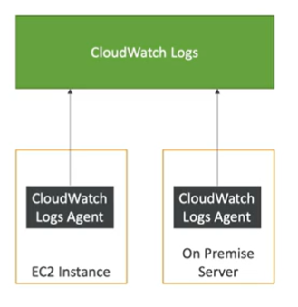

# AWS CloudWatch agent

- By default Cloudwatch monitors the EC2
    - CPU utilization
    - Network utilization
    - Disk performance
    - Disk reads/writes

- By default cloudwatch monitors EC2 instances at 5 minute intervals.  If you want to monitor at 1 minute intervals, you need to install the CloudWatch agent.
- Enables you to collect both system metrics and log files from EC2 instances and on-premises servers

## References

https://docs.aws.amazon.com/AmazonCloudWatch/latest/monitoring/Install-CloudWatch-Agent.html

https://aws.amazon.com/blogs/mt/create-amazon-ec2-auto-scaling-policy-memory-utilization-metric-linux/

https://docs.aws.amazon.com/systems-manager/latest/userguide/systems-manager-parameter-store.html

https://tutorialsdojo.com/amazon-elastic-compute-cloud-amazon-ec2/

https://tutorialsdojo.com/amazon-cloudwatch/
