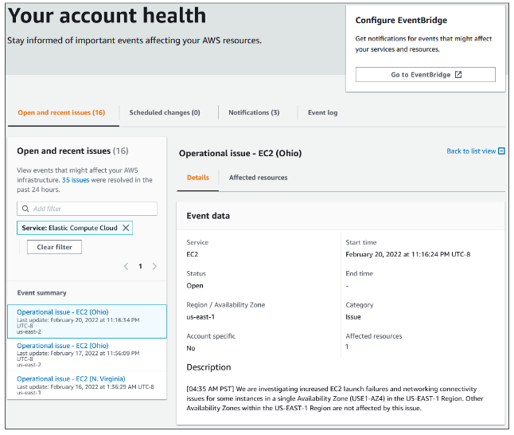
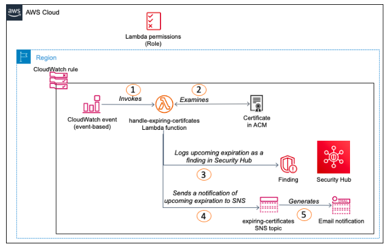

# AWS Health

- Provides ongoing visibility into the state of your AWS resources, services, and accounts.
- The service delivers alerts and notifications triggered by changes in the health of AWS resources.

- The AWS Health Dashboard organizes issues in three groups:
    - Open and recent issues – restricted to issues whose start time is within the last seven days.
    - Scheduled changes – contains items that are ongoing or upcoming.
    - Other notifications – restricted to issues whose start time is within the last seven days.

# Use Cases

- ACM certificate expiration

## References

https://tutorialsdojo.com/aws-health/

https://docs.aws.amazon.com/health/latest/ug/what-is-aws-health.html

https://docs.aws.amazon.com/health/latest/ug/getting-started-health-dashboard.html