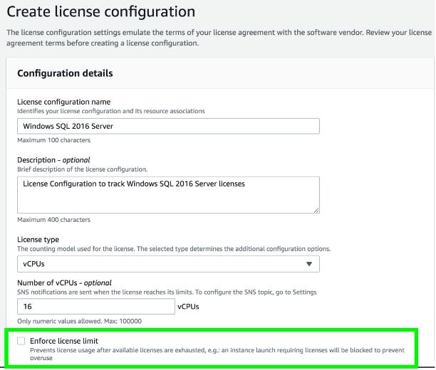

# AWS License Manager

- Makes it easier to manage licenses in AWS and on-premises servers from software vendors such as Microsoft, Oracle, and SAP.
- Works across AWS and on-premises servers.
- Provides control and visibility into the usage of your licenses, enabling you to limit licensing overages and reduce the risk of non-compliance.
- Supports a variety of licensing rule
    - Perpetual licenses-no expiration date
    - Floating - sharable
    - Subscription - time-based
    - Usage-based - based on usage

## References

https://tutorialsdojo.com/aws-license-manager/

https://docs.aws.amazon.com/license-manager/latest/userguide/license-manager.html

https://docs.aws.amazon.com/license-manager/latest/userguide/license-manager-overview.html

https://aws.amazon.com/blogs/mt/mechanisms-to-govern-license-usage-with-aws-license-manager/