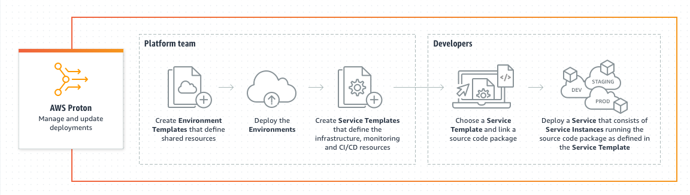

# AWS Proton

- A managed delivery service for deploying container and serverless applications
- Uses templates to define and maintain standard application stacks, which include the architecture, infrastructure resources, and the CI/CD pipeline

## References
https://tutorialsdojo.com/aws-proton/