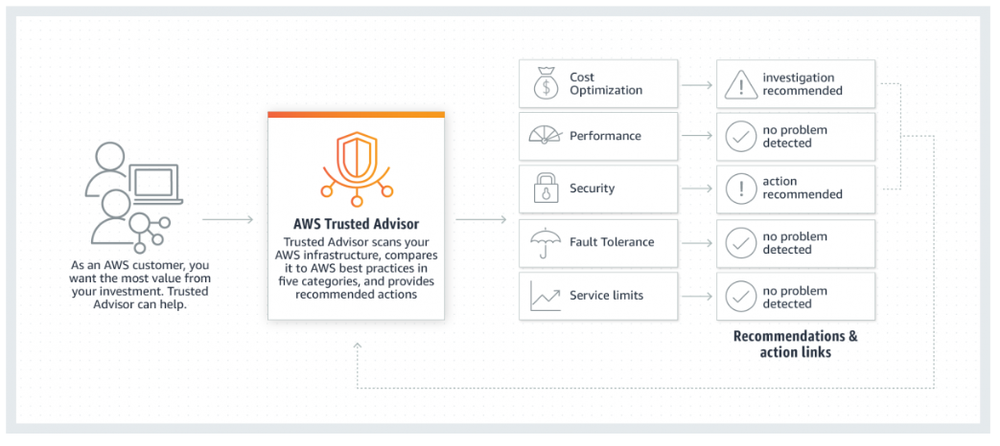

# AWS Trusted Advisor

Trusted Advisor analyzes your AWS environment and provides best practice recommendations in five categories:
- Cost Optimization
- Performance
- Security
- Fault Tolerance
- Service Limits

## Practice Test 5, Question 30

A company has multiple research departments that have deployed several resources to the AWS cloud. The departments are free to provision their own resources as they are needed. To ensure normal operations, the company wants to track its AWS resource usage so that it is not reaching the AWS service quotas unexpectedly.

Which combination of actions should the Solutions Architect implement to meet the company requirements? (Select TWO.)

Answer:

- Write an AWS Lambda function that refreshes the AWS Trusted Advisor service limits check and sets it to run every 24 hours
- Capture the events using Amazon EventBridge (Amazon CloudWatch Events) and use a Amazon Simple Notification Service (Amazon SNS) topic as the target for notifications

## References

https://tutorialsdojo.com/aws-trusted-advisor/
