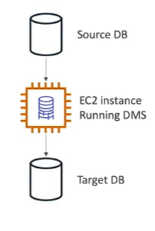
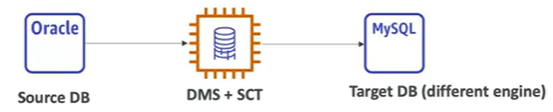
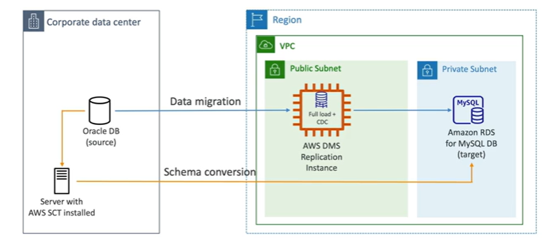

# Database Migration Service - DMS

- Quickly and securely migrate databases to AWS, resilient, self-healing
- The source database remains available during the migration
- Supports
    - Homogeneous migrations: (Oracle to Oracle)
    - Heterogeneous migrations: (Oracle to Aurora)
- Continuous data replication using CDC (Change Data Capture)
- You must create an EC2 instance to run the replication software

## DMS Sources and Targets

Sources
    - On-Premise and EC2 instances database: Oracle, MS SQL Server, MySQL, MariaDB, PostgreSQL, SAP ASE, MongoDB, and others
    - Azure: Azure SQL Database
    - Amazon RDS: all including Aurora
    - Amazon S3
    - DocumentDB

Targets
    - On-Premise and EC2 instances database: Oracle, MS SQL Server, MySQL, MariaDB, PostgreSQL, SAP ASE, MongoDB, and others
    - Amazon RDS: all including Aurora
    - Redshift, DynamoDB, S3
    - OpenSearch Service
    - Kinesis Data Streams
    - Apache Kafka
    - DocumentDB & Amazon Neptune
    - Redis and Babelfish

## AWS Schema Conversion Tool (AWS SCT)

- Convert your database schema from one engine to another
- Example OLTP: (SQL Server to Oracle) to MySQL, PostgreSQL, Aurora, and others
- Example OLAP: (Teradata or Oracle) to Amazon Redshift

- You do not need to use AWS SCT if you are migrating the same DB engine
    - Example: On-Premise PostgreSQL to Amazon RDS PostgreSQL
    - The DB engine is still PostgreSQL (RDS is the platform)

## DMS - Continuous Data Replication

## AWS DMS - Multi-AZ Deployment

- When Multi-AZ is enabled, AWS DMS creates a replication instance in each of the two Availability Zones
- Advantages:
    - Provided Data Redundancy
    - Eliminates I/O freezes 
    - Minimize latency spikes

## References

https://tutorialsdojo.com/aws-database-migration-service/

https://docs.aws.amazon.com/dms/latest/userguide/Welcome.html

