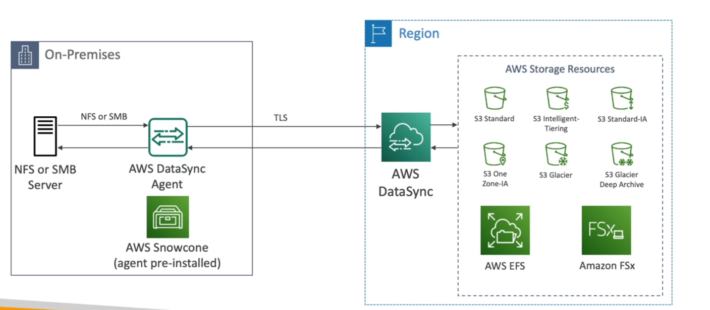
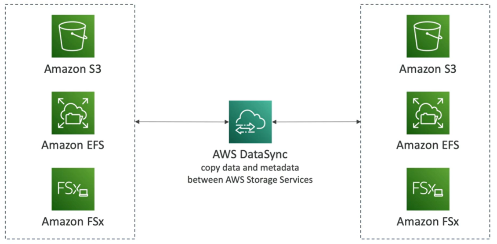

# AWS DataSync

- Move large amount of data to and from 
    - On-premises / other cloud to AWS (NFS, SMB, HDFS, S3 API...) - needs agent
    - AWS to AWS (different storage services) - no agent needed

- Can sychronize to:
    - Amazon S3 (any storage class - including Glacier)
    - Amazon EFS
    - Amazon FSx (Windows, Lustre, NetApp, OpenZFS....)

- Replication tasks can be scheduled hourly, daily, weekly
- File permissions and metadata are preserved (NFS POSIX, SMB)
- One agent task can use 10 Gbps, can setup a bandwidth limit

AWS DataSync NFS/SMB to AWS (S3, EFS, FSx) - needs agent

AWS Snowcone has a datasync agent built-in.  You can use Snowcone to move data to AWS.

AWS DataSync AWS to AWS (S3, EFS, FSx) - no agent needed

## References

https://tutorialsdojo.com/aws-datasync/

Storage Gateway vs DataSync
https://youtu.be/tmfe1rO-AUs

