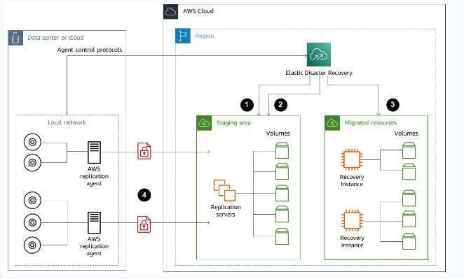

# Elastic Data Recovery

In the event of a disaster, AWS Elastic Disaster Recovery (AWS DRS) assists in performing a failover to AWS for immediate recovery. After mitigating the disaster, a failback to the original source infrastructure is necessary. AWS DRS facilitates preparedness through easy drill launches and frequent testing of instances. During a failover, recovery instances are launched in AWS based on a selected snapshot. To complete the failback, the AWS Elastic Disaster Recovery Failback Client is installed on the target server, and specific credentials are generated. Cross-Region or cross-AZ failover and failback can be executed directly from the AWS DRS Console. For vCenter, AWS DRS offers scalable failback with the DRS Mass Failback Automation client (DRSFA client). Once the failback is finished, the recovery instance can be terminated, deleted, or disconnected.

## Use Cases
- On-premises to AWS
- Cloud to AWS
- AWS Region to AWS Region 

## References
https://aws.amazon.com/disaster-recovery/
