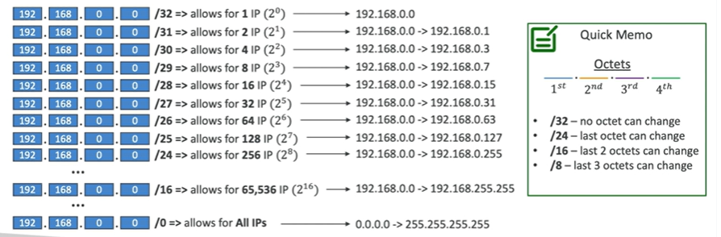

# Understanding CIDR - IPv4

- Classless Inter-Domain Routing (CIDR) is a method for allocating IP addresses and routing Internet Protocol packets
- Used in Security Groups rules, NACL rules and AWS networking in general
- They help to define an IP address range:
    - WW.XX.YY.ZZ/32 - 1 IP address
    - 0.0.0.0/0 - all IP addresses
    - 192.168.0.0/26 => 192.168.0.0 - 192.168.0.63 - or 64 addresses

## Understanding CIDR - Subnet Mask

- The Subnet mask allows part of the underlying IP to get additional next values from the base IP

