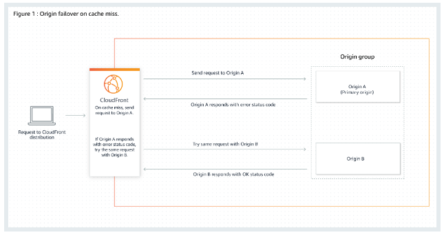

# CloudFront Origins

- S3 bucket
    - For distributing files and caching them at the edge
    - Enhanced security with Origin Access Control (OAC)
    - OAC is replacing Origin Access Identity (OAI)
    - CloudFront can be used to upload files to S3 which is called ingress

- Custom Origin (HTTP)
    - Application Load Balancer
    - EC2 Instance
    - S3 Website (must enable static website hosting first)
    - Any HTTP backend you want

## CloudFront Origin Failover

You can also set up CloudFront with origin failover for scenarios that require high availability. An origin group may contain two origins: a primary and a secondary. If the primary origin is unavailable or returns specific HTTP response status codes that indicate a failure, CloudFront automatically switches to the secondary origin. To set up origin failover, you must have a distribution with at least two origins.

You also need to configure the instances to be part of the origin group to ensure that the application is highly available.

## References

https://tutorialsdojo.com/amazon-cloudfront/

https://docs.aws.amazon.com/AmazonCloudFront/latest/DeveloperGuide/high_availability_origin_failover.html

https://docs.aws.amazon.com/AmazonCloudFront/latest/DeveloperGuide/Introduction.html

https://aws.amazon.com/cloudfront/faqs/

