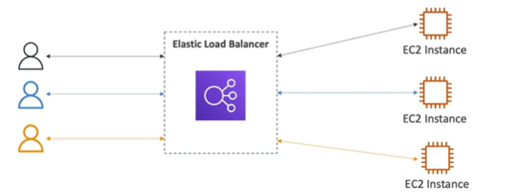
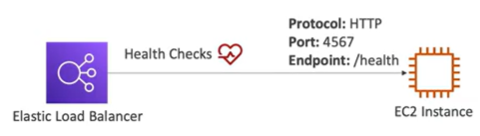
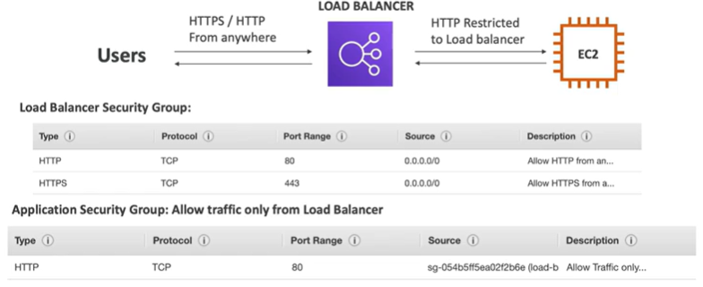

# Load Balancing

- Load Balancers are servers that forward internet traffic to multiple servers (EC2 instances) downstream.

## Why use a load balancer?

- Spread load across multiple downstream instances
- Expose a single point of access (DNS) to your application
- Seamlessly handle failures of downstream instances
- Do regular health checks to your instances
- Provide SSL termination (HTTPS) for your websites
- Enforce stickiness with cookies
- High availability across zones
- Separate public traffic from private traffic

## Why use an ELB?

- An ELB (Elastic Load Balancer) is a managed load balancer
    - AWS guarantees that it will be working
    - AWS takes care of upgrades, maintenance, high availability
    - AWS provides only a few configuration knobs

- It cost less to setup your own load balancer but it will be a lot more effort on your end

- It is integrated with many AWS offerings / services
    - Works well with EC2, ECS, EKS, Lambda, etc...
    - Integrated with AWS Certificate Manager (ACM) for SSL
    - Integrated with AWS WAF (Web Application Firewall) for security
    - Integrated with Route53 for DNS
    - Works well with Auto Scaling groups

## Health Checks

- Health Checks are crucial for Load Balancers
- They enable the load balancer to know if instances it forwards traffic to are available to reply to requests
- The health check is done on a port and a route (/health is common)
- If the response is not 200 (OK), then the instance is unhealthy

## Types of load balancers on AWS

4 types of load balancers:

- Classic Load Balancer (v1 - old generation) 2009
    - HTTP, HTTPS, TCP, SSL (secure TCP) 
- Application Load Balancer (v2 - new generation) 2016
    - HTTP, HTTPS, websocket
    - Supports weighted targets like Route53
    
- Network Load Balancer (v2 - new generation) 2017
    - TCP, TLS (secure TCP), UDP
- Gateway Load Balancer (v2 - new generation) 2020
    - Operates at layer 3 (Network layer) - IP Protocol

- Overall, it is recommended to use the newer / v2 generation load balancers

## Load Balancer Security Groups

## References

Overview
https://youtu.be/UBl5dw59DO8

Cheat Sheet
https://tutorialsdojo.com/aws-elastic-load-balancing-elb/

https://aws.amazon.com/elasticloadbalancing/features

https://aws.amazon.com/elasticloadbalancing/faqs/

https://aws.amazon.com/blogs/aws/new-application-load-balancer-simplifies-deployment-with-weighted-target-groups/

https://docs.aws.amazon.com/elasticloadbalancing/latest/application/load-balancer-target-groups.html

