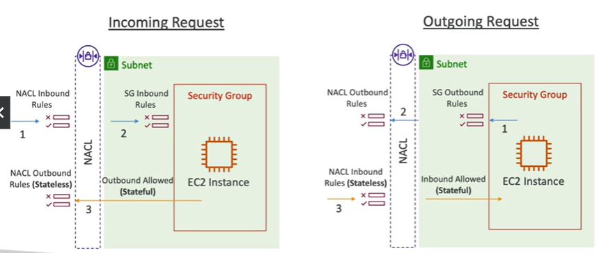

# Security Groups & Network access Control Lists

Inbound
1. NACL rules are on the subnet and evaluated first
2. SG inboard rules are evaluated next
3. SG are stateful so outbound traffic is automatically allowed
4. NACL is stateless so outbound rules must be explicitly allowed

Outbound
1. SG outbound rules are evaluated first
2. NACL outbound rules are evaluated next
3. NACL inbound rules are evaluated next
4. SG are stateful so inbound traffic is automatically allowed

## Network Access Control List (NACL) 

- NACLS are like firewalls which control traffic from and to subnets
- One NACL per subnet, new subnets are assigned the Default NACL
- You define NACL Rules:
    - Rules have a number (1-32766), higher precedence with a lower number
    - NACL rules include rule number,protocol, port range, destination CIDR, and allow or deny
    - First rule that matches will drive the decision
    - Example: if you define #100 ALLOW 10.0.0.10/32 and , then #200 DENY 10.0.0.10/32, the IP address will be allowed because 100 has a higher precedence over 200
    - The last rule is an asterisk (*) which denies a request in case of no rule match
    - AWS recommends adding rules by increments of 100
- Newly created NACLs will deny everything by default
- NACLs are a great way of blocking a specific IP address at the **subnet level**

Shows that the NACLs are at the subnet level.  In this diagram either the public or private subnet

## Default NACL

- Accepts everything inbound and outbound with the subnets its associated with
- Do NOT modify the default NACL, instead create custom NACLs

## Ephemeral Ports

- For any two endpoints to establish a connection, they must use ports
- Clients connect to a defined port, and expect a response on a ephemeral port
- Different Operations Systems use different port ranges, examples:
    - IANA & MS Windows 10 -> 49152-65535
    - Many Linux Kernels -> 32768-60999
    - Mac OS X -> 49152-65535

## NACL with Ephemeral Ports

## NACL rules for each target subnets CIDRs

If you have multiple subnets, you need to create a rule for each subnet CIDR in each NACL associated with that subnet since each subnet has its own CIDR

## Security Groups vs NACLs

## References

https://tutorialsdojo.com/amazon-vpc/

https://docs.aws.amazon.com/vpc/latest/userguide/vpc-network-acls.html

