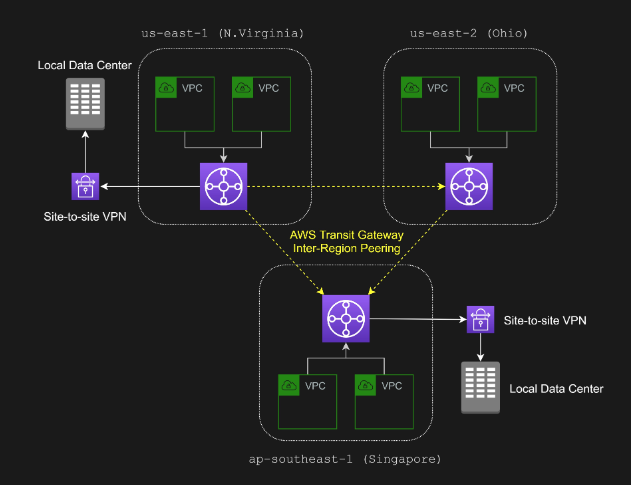

# AWS Transit Gateway

- Enable customers to connect to VPC
- A transit gateway attachment is both a source and a destination of packets. You can attach the following resources to your transit gateway:
    - One or more VPCs
    - One or more VPN connections
    - One or more AWS Direct Connect gateways
    - One or more transit gateway peering connections

