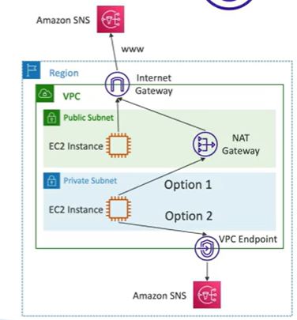
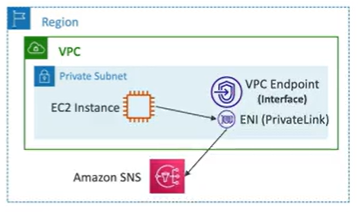
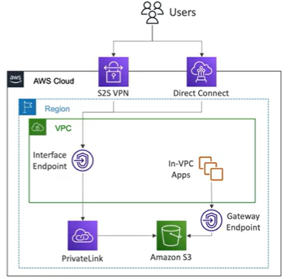

# AWS VPC Endpoints (AWS PrivateLink)

- Every AWS service is publicly exposed (public URL)
- VPC Endpoints (powered by AWS PrivateLink) allow you to connect to AWS services using a private network instead of a public Internet connection
- They are redundant and scale horizontally
- They remove the need for IGW, NAT, VPN, Direct Connect

## VPC Endpoint Types

- Interface Endpoint
    - Provision an ENI (private IP address) as an entry point (must attach a security group)
    - Supports most AWS services
    - $ per hour + $ per GB of data processed

- Gateway Endpoint
    -Provisions a gateway and must be used as a target in a route table (does not require a security group)
    - Only supports S3 and DynamoDB
    - Free

## Compare Interface and Gateway Endpoints

- Gateway is most likely preferred
- Cost: Gateway is free, Interface has a cost
- Interface endpoint is preferred access from on-premises, a different VPC or a different region

## References

https://docs.aws.amazon.com/AmazonS3/latest/userguide/privatelink-interface-endpoints.html

https://docs.aws.amazon.com/vpc/latest/privatelink/vpce-gateway.html