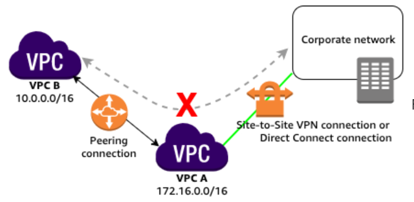

# AWS VPC

## VPC Peering

- VPC peering connection does not support edge to edge routing. This means that if either VPC in a peering relationship has a gateway to an AWS service, such as an Internet gateway or VPN connection, then resources in the other VPC do not have access to that gateway.

For example, if VPC-A and VPC-B are peered, and VPC-A has any of these connections, then instances in VPC-B cannot use them:
- VPN connection or Direct Connect
- An internet connection through an Internet gateway
- An Internet connection in a private subnet to a NAT device
- A gateway VPC endpoint to an AWS service, such as Amazon S3, Amazon DynamoDB, or Amazon Kinesis

## Migrate to IPv6

https://docs.aws.amazon.com/vpc/latest/userguide/vpc-migrate-ipv6.html

## Question and Answer

### Question 1
A media company has two VPCs: VPC-1 and VPC-2 with peering connection between each other. VPC-1 only contains private subnets while VPC-2 only contains public subnets. The company uses a single AWS Direct Connect connection and a virtual interface to connect their on-premises network with VPC-1.

Which of the following options increase the fault tolerance of the connection to VPC-1? (Select TWO.)

- Establish another AWS Direct Connect connection and a virtual interface in the same region as VPC-1
- Establish a hardware VPN over the Internet between VPC-1 and the on-premises network

## References 

https://tutorialsdojo.com/amazon-vpc/

