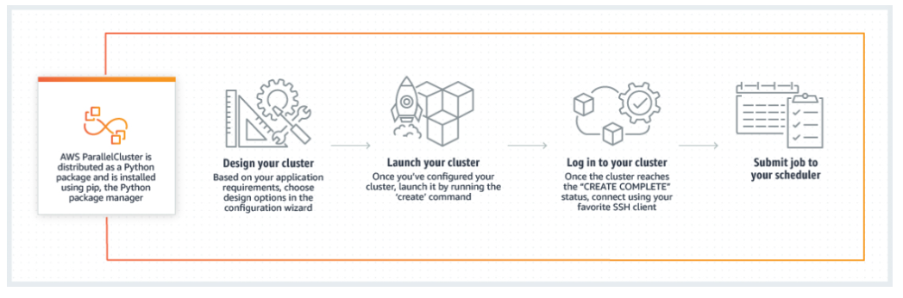

# AWS ParallelCluster

- AWS ParallelCluster is an AWS-supported open-source cluster management tool that makes it easy to deploy and manage High Performance Computing (HPC) clusters on AWS
- Uses a simple text file to model and provision all the resources needed for your applications
- Provisions a master instance for build and control, a cluster of compute instances, and a shared file system, and a batch scheduler.

- 4 supported schedulers:
  - SGE (son of Grid Engine)
  - Torque
  - Slurm
  - AWS Batch

- AWS ParallelCluster supports
    - On-Demand Instances
    - Spot Instances
    - Reserved Instances

## References

https://tutorialsdojo.com/aws-parallelcluster/

https://aws.amazon.com/hpc/parallelcluster/
https://docs.aws.amazon.com/parallelcluster/latest/ug/what-is-aws-parallelcluster.html
https://aws.amazon.com/hpc/faqs/
https://aws.amazon.com/blogs/opensource/aws-parallelcluster/

