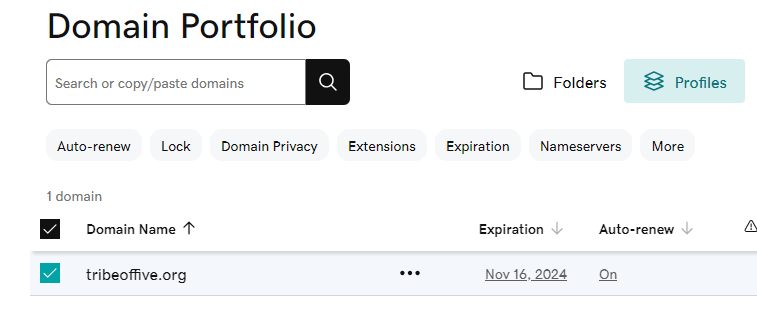
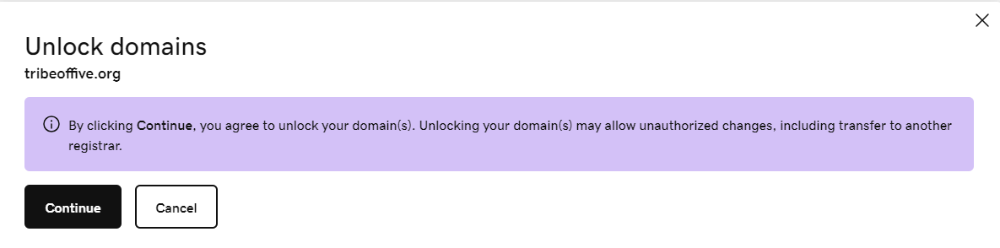

# How to transfer your domain from GoDaddy to Route 53

Follow this [article](https://odalabasmaz.medium.com/how-to-transfer-your-domains-from-godaddy-to-amazon-route-53-1e3486beeee8).

## Step 1: Unlock your domain

Go to the [GoDaddy Domain Manager](https://dcc.godaddy.com/domains/) and then select your domain and click the 3 dots on the right and select **Turn Lock Off**.

Select continue when you get the warning.
