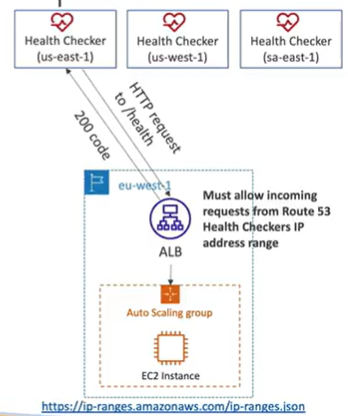

# Health Checks - Monitor and Endpoint

- About 15 global health checkers with check the endpoint health
    - Healthy/Unhealthy Threshold - 3 (default)
    - Interval - 30 seconds (can set to 10 sec - higher cost)
    - Supported protocols: HTTP, HTTPS, TCP
    - if > 18% of health checkers report healthy, Route 53 considers it Healthy. Otherwise it is unhealthy
    - Ability to choose which locations you want Route 53 to use

- Health checks pass only when the endpoint responds with a 2xx or 3xx status code
    - 2xx - Success
    - 3xx - Redirection

- Health checks can be setup to pass/fail based on text in the first 5120 bytes of the response

- Configure your router/firewall to allow incoming traffic from the Route 53 health checkers

