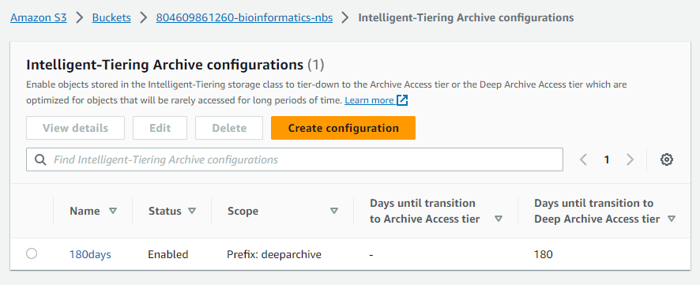
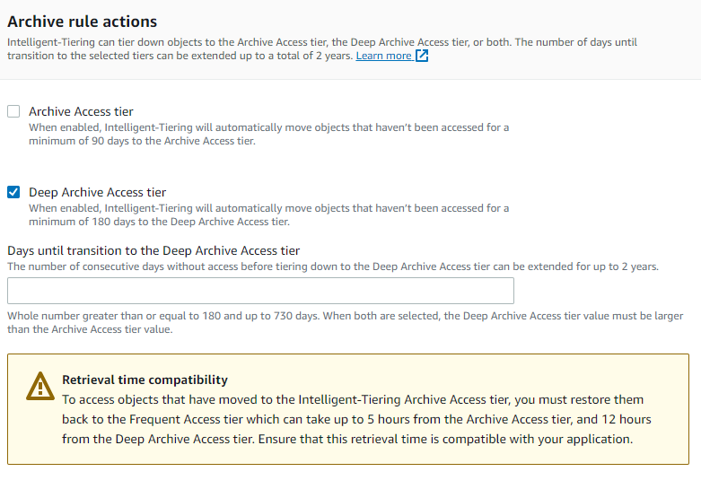

# S3 Intelligent Tiering 

In S3, you can use the Intelligent Tiering storage class to optimize storage costs for data with unknown or changing access patterns. The S3 Intelligent-Tiering storage class is designed to optimize costs by automatically moving data to the most cost-effective access tier, without performance impact or operational overhead.

In the S3 bucket details there are two sections for monitoring the S3 Intelligent Tiering storage class.  One is Intelligent-Tiering Archive configuration and the other is Lifecycle rules.  

## Intelligent-Tiering Archive configuration

Enable objects stored in the Intelligent-Tiering storage class to tier-down to the Archive Access tier or the Deep Archive Access tier which are optimized for objects that will be rarely accessed for long periods of time.

To setup open the S3 bucket and click on the Properties tab.  Then click on the Intelligent-Tiering Archive configuration.  Then click on Create configuration.

The Scope limits what gets archived.  The archive prefix is how you limit what gets archived to particular objects.  For example if you have a prefix of `archive/` then any object that starts with `archive/` will be archived.  If you have a prefix of `archive/2020/` then any object that starts with `archive/2020/` will be archived.  You can have multiple archive prefixes.

Rackspace has setup archiving to only archive objects that start with the prefix `deeparchive`.  So any folder with the prefix `deeparchive` will be archived.  

The archive rules are the rules that you want to apply to the archive prefix.  You can have multiple archive rules for the same archive prefix.  The archive rules are the number of days that the object must be in the Intelligent-Tiering storage class before it is moved to the Archive Access tier or the Deep Archive Access tier.

The Archive rule actions allow you to put the S3 object in Archive Access tier or Deep Archive Access tier.  The Archive Access tier will automatically move objects that haven't been accessed for a minium of 90 days to the Archive Access tier.

Deep Archive Access tier when enabled, Intelligent-Tiering will automatically move objects that haven't been accessed for a minimum of 180 days to the Deep Archive Access tier.  The minium number of days until transition to Deep Archive Access tier is 180 days and the maximum is 730 days.

To restore back from Intelligent Tiering Archive to Intelligent Tiering, you must restore them back to Frequent Access tier which can take up to 5 hours from the Archive Access tier, and 12 hours from the Deep Archive Access tier.

## Lifecycle rules

This allows for more complex Lifecycle rules