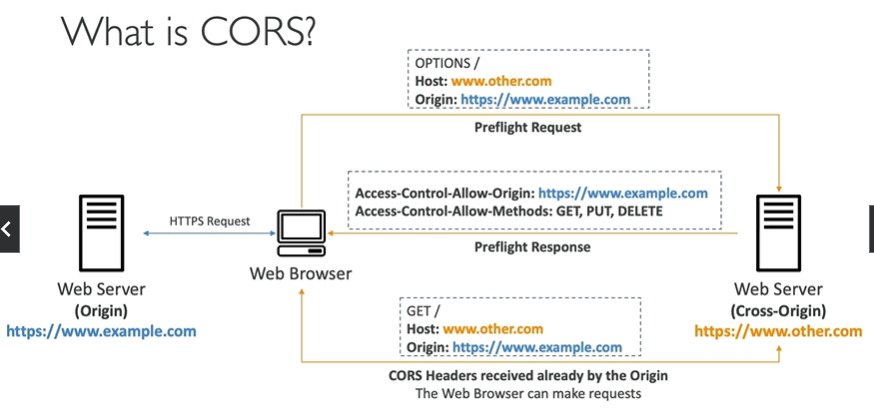

# Cross-Origin Resource Sharing

- Origin = scheme(protocol) + host(domain) + port
    - example: https://www.example.com:443
- CORS is a mechanism that allows restricted resources on a web page to be requested from another domain outside the domain from which the first resource was served.
- Same origin: http://example.com/app1 & http://example.com/app2
- Different origin: http://example.com/app1 & http://otherexample.org/app1

- To allow cross-origin requests, you need to configure the CORS configuration on the S3 bucket.
- This is done in a JSON file as part of the S3 target bucket configuration.

