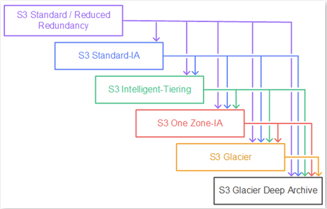

# S3 Lifecycle Rules

- You can transiion objects to different storage classes
- For infrequently accessed object, move them to Standard IA
- For archive objects, move them to Glacier
- Moving objects can be automated using a lifecycle policy

Your application on EC2 creates image thumbnails after profile pictures and uploaded to Amazon S3.  These thumbnails can easily be recreated, and only need to be kept for 60 days.  The source images should be able to be immediately retrieved for 60 days, and afterwards, the user can wait up to 6 hours.  How would you design this?

- Source image will be in standard, and transition to S3 Glacier Flexible Storage class after 60 days.
- Thumbnail in One Zone - IA for 60 days. After 60 days delete the thumbnail. 

## Storage Class Analysis

- Help you decide when to transition objects to different storage classes
- Recommendations for Standard and Standard IA
- No recommendations for One-Zone IA or Glacier
- Report is updated daily
- 24 to 48 hours to start seeing data analysis