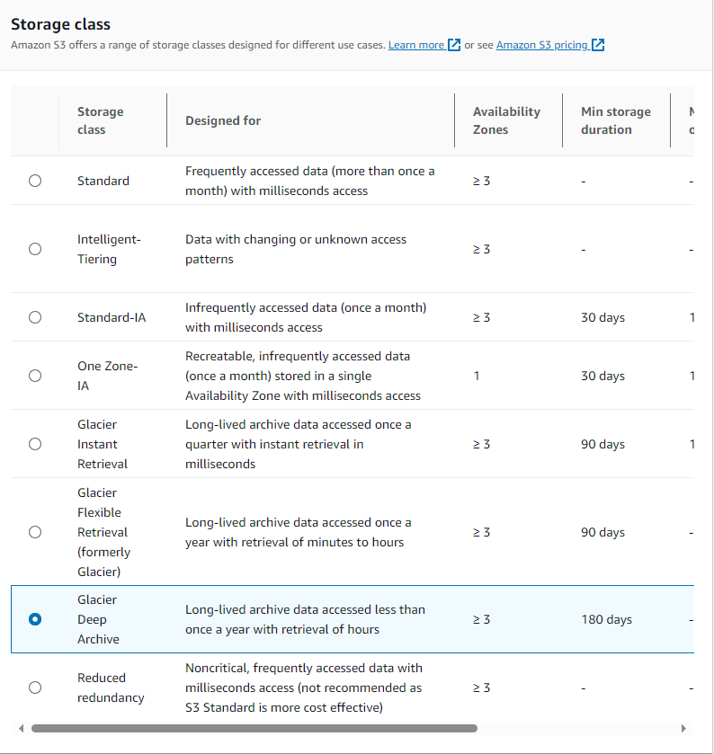

# How to manually move to a different S3 storage classes

You can move objects to different storage classes in the console.  While this is possible it is tedious and it is better to setup lifecycle rules to move objects to different storage classes.

The S3 console is good for moving a few objects, but lifecycle rules are better for moving many objects.

To move objects to different storage classes in the console:

1) Select the S3 object(s) you want to move
2) Choose Actions -> Edit Storage Class

3. Choose a storage class

