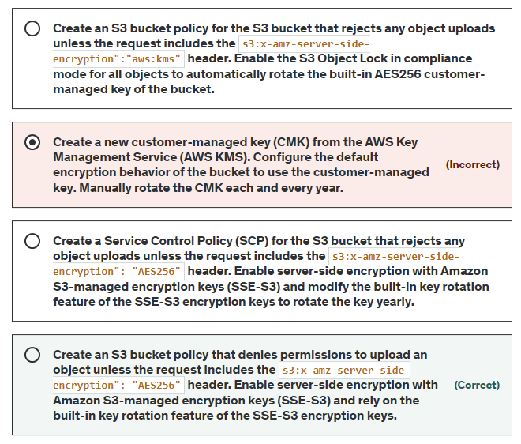
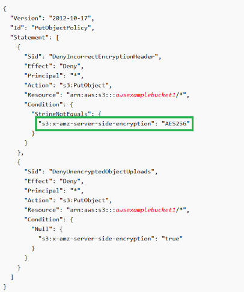

# SAA Practice Test 4 Question 9

A multinational bank is storing its confidential files in an S3 bucket. The security team recently performed an audit, and the report shows that multiple files have been uploaded without 256-bit Advanced Encryption Standard (AES) server-side encryption. For added protection, the encryption key must be automatically rotated every year. The solutions architect must ensure that there would be no other unencrypted files uploaded in the S3 bucket in the future.

Which of the following will meet these requirements with the LEAST operational overhead?

## S3 Bucket Policy

- Resource-based policy
- Grant access permissions to your bucket and objects in it

## References

https://tutorialsdojo.com/amazon-s3/

https://docs.aws.amazon.com/AmazonS3/latest/userguide/bucket-policies.html

https://docs.aws.amazon.com/AmazonS3/latest/userguide/UsingServerSideEncryption.html

https://docs.aws.amazon.com/kms/latest/developerguide/rotate-keys.html

