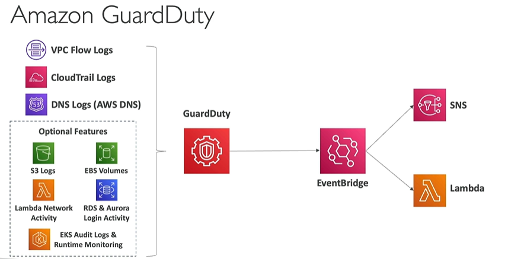

# Amazon GuardDuty

- An intelligent threat detection service. It analyzes billions of events across your AWS accounts from AWS CloudTrail (AWS user and API activity in your accounts), Amazon VPC Flow Logs (network traffic data), and DNS Logs (name query patterns).

- Intelligent threat detection service to protect your AWS Account
- Uses Machine Learning to detect anomalies
- One click to enable, no need to install software
- Input data includes:
    - CloudTrail Event logs - unusual API calls, unauthorized deployments
    - VPC Flow Logs - unusual internal traffic, unusual IP addresses
    - DNS Logs - compromised EC2 instances sending traffic to known malicious domains
    - And other optional services

## References

https://tutorialsdojo.com/amazon-guardduty/

