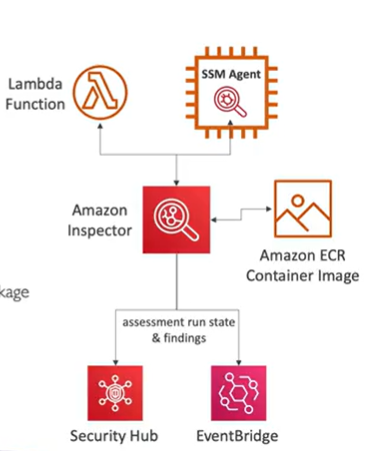

# Amazon Inspector

- Automated security assessment service

- For EC2 instances
    - Leverages AWS Systems Manager to install agents on EC2 instances
    - Analyzes against unintended network accessibility, vulnerabilities, insecure configurations
    - Analyze the running OS against known vulnerabilities
- For Container Images pushed to Amazon ECR
    - Assessment of container images
- For Lambda Functions
    - Identifies software vulnerabilities in function code and package dependencies

- Reporting & integration with AWS Security Hub
- Send findings to Amazon Event Bridge

## What does Inspector evaluate?

- Continuous scanning of the infrastructure, only when needed
- Package vulnerabilities (EC2, ECR & Lambda) - database of CVE
- Network Reachability
    - Unintended network accessibility
    - Open ports, security groups, ACLs

- A risk score is associated with all vulnerabilities for prioritization