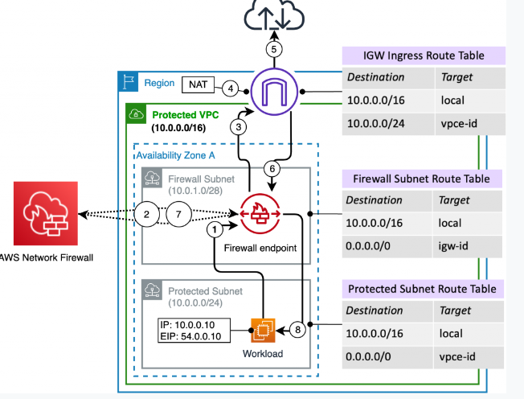

# AWS Network Firewall

AWS Network Firewall is a stateful, managed, network firewall, and intrusion detection and prevention service for your virtual private cloud (VPC). With Network Firewall, you can filter traffic at the perimeter of your VPC. This includes traffic going to and coming from an internet gateway, NAT gateway, or over VPN or AWS Direct Connect. Network Firewall uses Suricata — an open-source intrusion prevention system (IPS) for stateful inspection.

You can use Network Firewall to monitor and protect your Amazon VPC traffic in a number of ways, including the following:

- Pass traffic through only from known AWS service domains or IP address endpoints, such as Amazon S3.

- Use custom lists of known bad domains to limit the types of domain names that your applications can access.

- Perform deep packet inspection on traffic entering or leaving your VPC.

- Use stateful protocol detection to filter protocols like HTTPS, independent of the port used.

## Question - PT-5, Question 52

A business plans to deploy an application on EC2 instances within an Amazon VPC and is considering adopting a Network Load Balancer to distribute incoming traffic among the instances. A solutions architect needs to suggest a solution that will enable the security team to inspect traffic entering and exiting their VPC.

Which approach satisfies the requirements?

## References

https://aws.amazon.com/blogs/networking-and-content-delivery/deployment-models-for-aws-network-firewall/

https://docs.aws.amazon.com/network-firewall/latest/developerguide/what-is-aws-network-firewall.html
