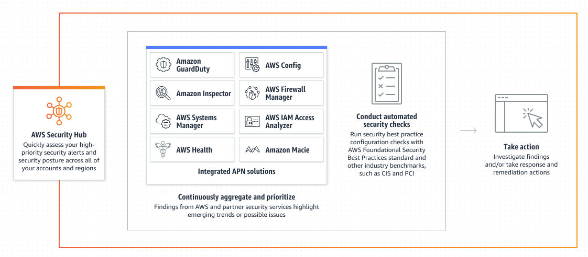

# AWS Security Hub

- AWS Security Hub provides a comprehensive view of your security state within AWS and your compliance with security industry standards and best practices.

## Features

- You now have a single place that aggregates, organizes, and prioritizes your security alerts, or findings, across multiple accounts, AWS partner tools, and AWS services such as Amazon GuardDuty, Amazon Inspector, Amazon Macie, AWS IAM Access Analyzer, AWS Firewall Manager, and AWS Audit Manager.
- Provides a comprehensive view of high-priority security alerts and compliance status across AWS accounts

- AWS Security Hub can run automated, continous account-level configuration and compliance checks based on industry standards and best practices, such as the Center for Internet Security (CIS) AWS Foundations Benchmark and the Payment Card Industry (PCI) Data Security Standard (DSS)
- AWS Security Hubs checks also leverage configuration items recorded by AWS Config.
- All findings are stored 90 days

## References

https://tutorialsdojo.com/aws-security-hub/