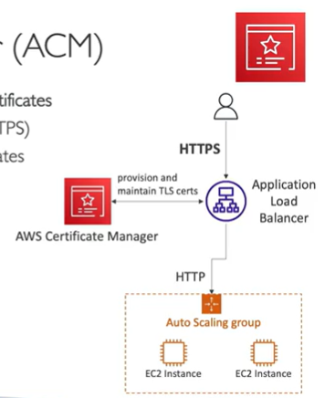
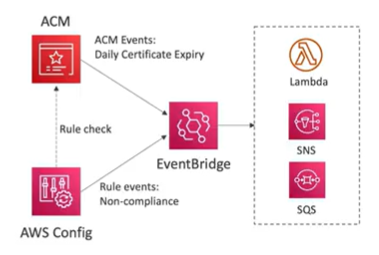
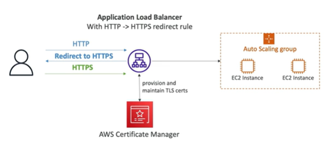
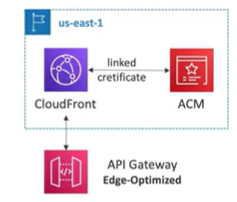
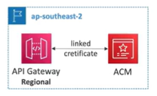

# AWS Certificate Manager (ACM)

- Easily provision, manage, and deploy SSL/TLS certificates for use with AWS services
- Provide in-flight encryption for traffic in and out of your AWS resources
- Supports both public and private TLS certificates
- Automatic TLS certificate renewal
- Integrates with (load TLS certificates on):
    - ELB (CLB, ALB, NLB) 
    - CloudFront 
    - API Gateway
    - Elastic Beanstalk
    - CloudFormation, etc...
- Cannot use ACM with EC2 (can't be extracted from ACM)

## ACM - Requesting Public Certificates

1. List domain names to be included in the certificate
    - Fully Qualified Domain Name (FQDN): corp.example.com
    - Wildcard Domain Name: *.example.com
2. Select validation method: DNS or Email
    - DNS validation is preferred for automation purposes
    - Email validation will send emails to contact address in the WHOIS database
    - DNS validation will leverage a CNAME record to DNS config (ex: Route 53)
3. It will take a few hours to get verified
4. The Public Certificate will be enrolled for automatic renewal
    - ACM automatically renews the ACM-generated certificates 60 days before expiry

## ACM - Importing a Public Certificate

- Option to generate the certificate outside of ACM and then import it
- No automatic renewal, must import a new certificate before expiry
- ACM sends daily expiration events starting 45 days prior to expiration
     - The # of days can be configured
     - Events appear in EventBridge
- AWS Config has a managed rule named acm-certificate-expiration-check to check for expiring certificates(configurable number of days)

## ACM - Integration with ALB

- Setup a redirect from HTTP to HTTPS

## ACM - API Gateway - Endpoint Types

API Gateway can be deployed in different modes:

- Edge-Optimized(default): For global clients
    - Requests are routed through CloudFront Edge Locations (improves latency)
    - The API Gateway still lives in only one region
- Regional
    - For clients within the same region
    - Could manually combine with CloudFront(more control over the caching strategies and distribution)
- Private
    - For clients accessing API Gateway from within a VPC using an interface VPC endpoint
    - The endpoint is accessible only from within the VPC
    - Use a resource policy to restrict access to the VPC endpoint
    - The API Gateway still lives in only one region

## ACM - Integration with API Gateway

- Create a custom domain name in API Gateway
- Edge-Optimized Endpoint Type (default): For Global clients
    - Requests are routed through the CloudFront Edge locations (improves latency)
    - The API Gateway still lives in only one region
    - The TLS Certificate must be in the same region as CloudFront, in us-east-1
    - Then setup CNAME or (better) A-Alias record in Route 53

    

- Regional:
    - For clients within the same region
    - The TLS Certifcate must be imported on API Gateway, in the same region as the API Stage

    

-

