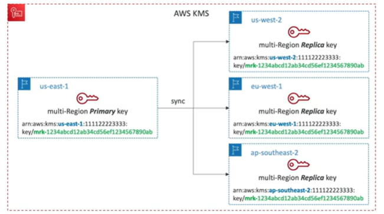

# KMS Multi-Region Keys

- Identical KMS keys in different AWS Regions that can be used interchangeably
- Multi-Region keys have the same key ID and key material in every AWS Region
- Encrypt in one region and decrypt in another
- No need to re-enrypt data when copying between regions
- KMS Mult-Region are NOT global resources(Primary and Replicas)
- Each Multi-Region key is managed independently

- Use cases: global client-side encryption, encryption on Global DynamoDB, Global Aurora, etc