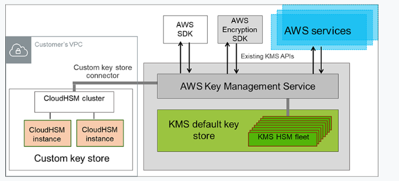

# AWS Key Management Server (KMS)

[Cheat Sheet](https://tutorialsdojo.com/aws-key-management-service-aws-kms/?src=udemy)

- AWS manages encryption keys for us
- Fully integrated with IAM for authorization
- Easy way to control access to data 
- Integrated with Cloudtrail to provide audit trail of all key usage
- You can connect to AWS KMS through a private endpoint in your VPC instead of connecting over the Internet
- You can define VPC endpoint policies, enabling you to increase the granularity of your security controls by specifying which principals can access the service and what actions they can perform

3 types of keys

- AWS managed keys
    - Free
    - Default encryption key for S3, EBS, RDS, Redshift, etc
    - Key policies, like rotation, are managed by AWS and cannot be modified
- Customer managed keys
    - Cost is $1 per per key per month
    - Key type can be Symmetric or Asymmetric
    - Key origin material is generated by AWS KMS.  Choice of AWS KMS, External or Custom key store
    - Can be single region or multi region
    - You can be very specific about who can use the key
    - Can allow other accounts to use the key
    - Keys can be rotated every year
- Customer key stores
    - Combine the controls provided by AWS CloudHSM with the integration of AWS KMS
    - You can use your own CloudHSM cluster to store your keys
    - When you create keys in AWS KMS, you choose to generate the key material in your cloud HSM cluster
    - CMKs that are generated in your customer key store never leave the HSM's in the CloudHSM cluster in plaintext and all AWS KMS operations that use the key material are performed in the cluster
    - Since you control your AWS CloudHSM cluster, you have the option to manage the lifecycle of your CMKs independently of AWS KMS.  There are four reasons why you might find a custom key store useful:
        1. You might have keys that are explicitly required to be protected in a single-tenant HSM or in a HSM over which you have direct control
        2. You might have keys that are required to be stored in a HSM that has been validated to FIPS 140-2 Level 3 overall
        3. You might need the ability to immediately delete key material from AWS KMS and to prove you have done so by indepedent means
        4. You might have a requirement to be able to audit all use of your keys independently of AWS KMS or AWS cloudTrail

    
     

