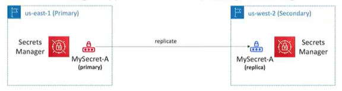

# AWS Secrets Manager

- New service, meant for storing secrets
- Capability to force rotation of secrets every X days
- Automate generation of secrets on rotation (uses Lambda)
- Integration with Amazon RDS (MySQL, PostgreSQL, Aurora)
- Secrets are encrypted using KMS
- Different and better than SSM parameter store since you have rotation management and tight integration with databases

- Mostly meant for RDS integration

## Multi-Region Secrets

- Replicate Secrets across multiple AWS Regions
- Secrets Manager keeps read replicas in sync with the primary Secret
- Ability to promote a read replica Secret to a standalone Secret
- Use cases: multi-region apps, disaster recovery strategies, multi-region DB...

