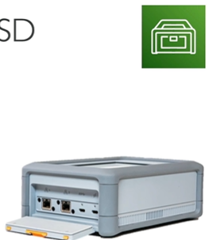
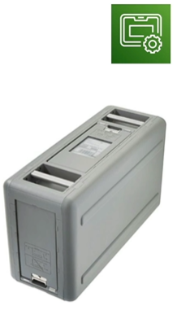
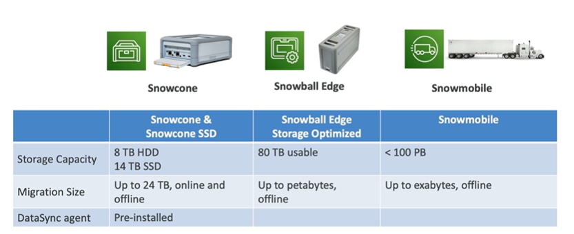

# AWS Snow Family

- AWS Snow Family is a collection of physical devices to help you move large amounts of data into and out of AWS
- Highly secure, portable devices to collect and process data at the edge, and migrate data into and out of AWS

- Data migration:
    - Snowcone
    - Snowball Edge
    - Snowmobile

- Edge computing:
    - Snowcone
    - Snowball Edge

## Snowcone

- Small, portable computing, anywhere, rugged and secure
- Light 4.5 lbs

- Snowcone - 8 TB of HDD storage
- Snowcone SSD - 14 TB of NVMe SSD storage
- Must provide own batteries or cables
- Can be sent back to AWS offline, or connect it to the network and use AWS DataSync to move data online
- Use cases: tactical edge computing, data collection, content distribution, IoT

## Snowball Edge (for data transfers)

- Physical data transport solution: move TBs or PBs of data in or out of AWS
- Alternative to moving data over the network
- Pay per data transfer job
- Provide block storage and Amazon S3-compatible object storage
- Snowball Edge Storage Optimized:
    - 80 TB of HDD capacity for S3 compatible object storage
    - 40 vCPUs and 80GB of memory for use with EC2 compute instances
- Snowball Edge Compute Optimized:
    - Storage: 42 TB of HDD or 28TB NVMe(non-volatile memory express) capacity for block volume and S3 compatible object storage
    - Compute: 104 vCPUs and 416GB of memory and optional GPU for use with EC2 compute instances
    - Storage clustering available (up to 16 nodes)
- Use cases: large data cloud migrations, DC decommission, disaster recovery

## Snowmobile

- Transfer exabytes of data
- 45-foot long ruggedized shipping container
- Each Snowmobile has 100 PB of capacity
- High security: temperature controlled

## Comparison

## AWS OpsHub
- AWS OpsHub is a software that runs on Snow Family devices
- It provides a central dashboard to manage your Snow Family devices
    - Unlocking and configuring single or clustered devices
    - Tracking the status of data transfers
    - Launching and managing EC2 instances, use DataSync to move data online, or NFS

## References

Snow Family Overview
https://youtu.be/9Ar-51Ip53Q

Snowball Edge Cheat Sheet
https://tutorialsdojo.com/aws-snowball-edge/

