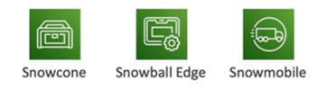
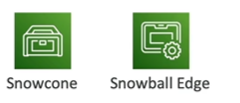

# AWS Snow Family

- AWS Snow Family is a collection of physical devices to help you move large amounts of data into and out of AWS
- Highly secure, portable devices to collect and process data at the edge, and migrate data into and out of AWS

- Data migration:
    - Snowcone
    - Snowball Edge
    - Snowmobile

- Edge computing:
    - Snowcone
    - Snowball Edge

## Comparison

## AWS OpsHub
- AWS OpsHub is a software that runs on Snow Family devices
- It provides a central dashboard to manage your Snow Family devices
    - Unlocking and configuring single or clustered devices
    - Tracking the status of data transfers
    - Launching and managing EC2 instances, use DataSync to move data online, or NFS

## References

Snow Family Overview
https://youtu.be/9Ar-51Ip53Q

Snowball Edge Cheat Sheet
https://tutorialsdojo.com/aws-snowball-edge/

