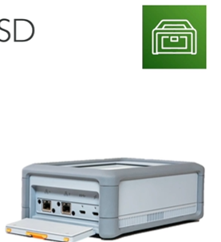

# AWS Snowcone

- Small, portable computing, anywhere, rugged and secure
- Light 4.5 lbs

- Snowcone - 8 TB of HDD storage
- Snowcone SSD - 14 TB of NVMe SSD storage
- Must provide own batteries or cables
- Can be sent back to AWS offline, or connect it to the network and use AWS DataSync to move data online
- Use cases: tactical edge computing, data collection, content distribution, IoT
