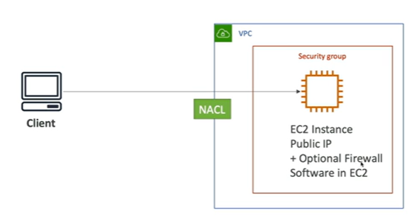
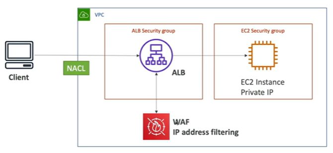
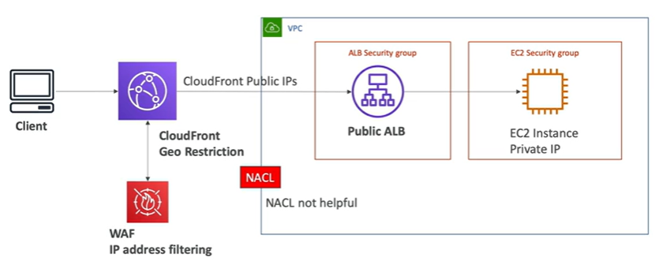

# Blocking an IP Address

- Easiest way is to use a NACL and block a specific IP address.  NACLs have both allow and deny rules
- Security groups can't be used to block IP addresses since they only have allow rules

## Blocking an IP address - with a ALB

- With ALB we have two security groups
    - ALB security group
    - EC2 security group
- EC2 security group has to allow access from ALB security group
- ALB does connection termination and then forwards the request to the EC2 instance

## Blocking an IP address - with a NLB

NLB's are similar to ALB. The only difference is that NLB's don't do connection termination.  They forward the request to the EC2 instance as is.

## Blocking an IP address - ALB + WAF

- WAF can be added to ALB to block IP addresses
- It supports complex rules and patterns.  More powerful than NACLs

## Blocking an IP address - ALB, CloudFront, WAF

- WAF on CloudFront will filter the IP addresses at the edge
- The ALB will only allow incoming cloudfront public IPs to be allowed so the **NACL** will not help block IPs
- If you want to block IP's from a country you can use Geo Restriction

