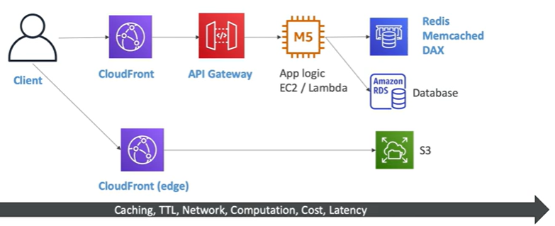

# Caching Strategies

- CloudFront is caching at the edge. Chance that things have changed in the origin.
- API Gateway has caching at the API level.  API Gateway is regional
- App Logic doesn't cache.  It is stateless.
- But App Logic can use cache in Elasticache (Redis or Memcached or DAX)

- Each cache options has pros and cons