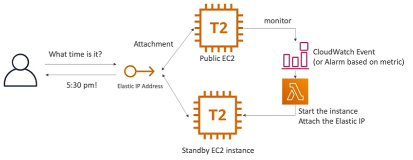
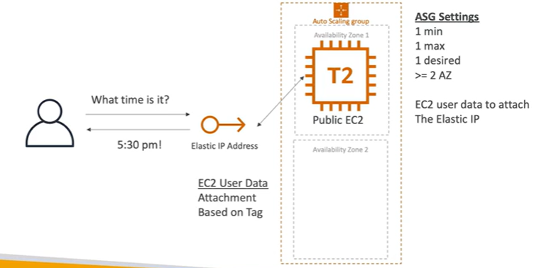
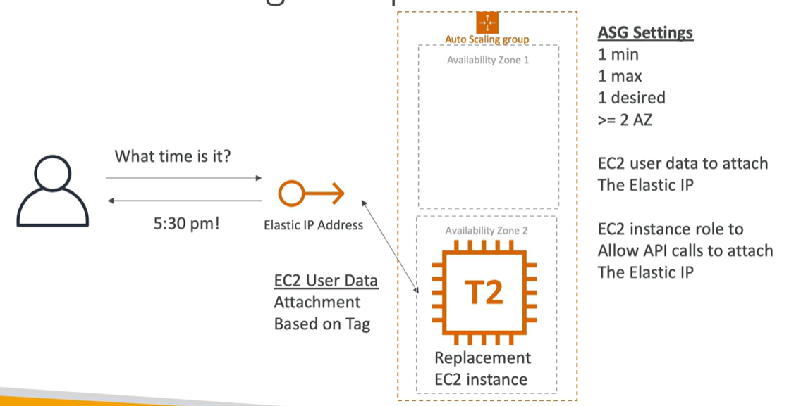
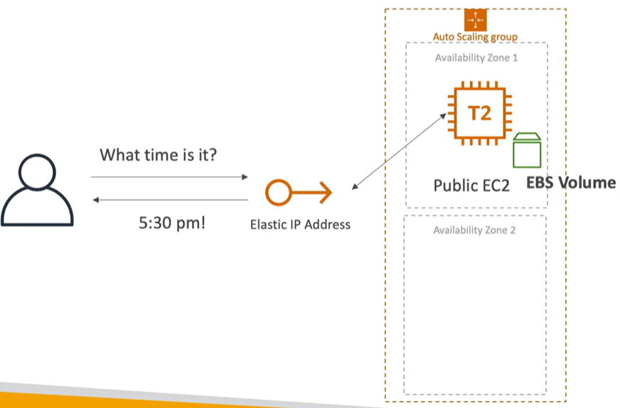
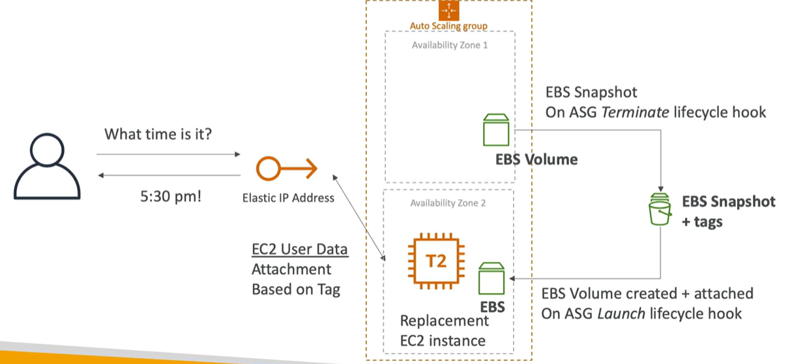

# Highly Available EC2 Instance

Different ways to make EC2 instance highly available:

## Standby Instance

- Elastic IP address is attached to the primary instance
- Cloudwatch events determine if the system is unhealthy
- If it is unhealthy, it will trigger a lambda function
- Lambda function will:
    - Start the standby instance
    - Attach the elastic IP address to the standby instance
    - Detach the elastic IP address from the primary instance
    - Terminate the primary instance

## Auto Scaling Group

- Auto Scaling Group (ASG) is used to manage the instances
- EC2 instance is started in first AZ
- User data attaches the Elastic IP based on tags
- EC2 instance goes down or is terminated
- ASG will launch a new instance in the second AZ
- User data runs and will attach the Elastic IP to the new instance
- Make sure EC2 instance roles to allow API to calls to attach Elastic IP

## Creating a highly available EC2 instance with ASG + EBS

- Same as before except you have a EBS volume attached to the instance. Example EBS has a database.
- On ASG termination lifecycle hook you create a new EBS Snapshot with tags
- On ASG launch lifecycle hook you create a new EBS volume from the snapshot 
- Elastic IP is attached to the new instance using User Data

