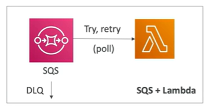
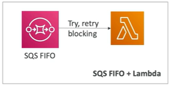
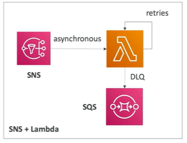
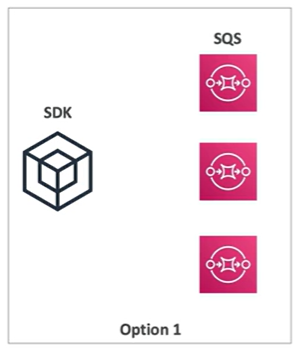
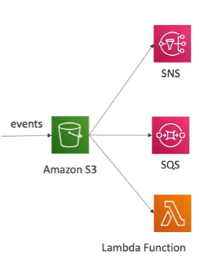
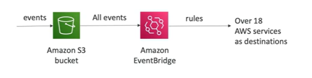
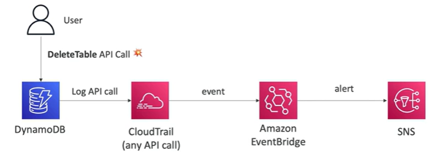
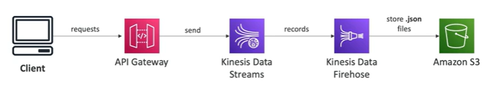

# Event Processing

## Lambda, SNS & SQS

- Messages arrived in SQS queue
- Lambda function polls the queue (try-retry mechanism)
- If Lambda function fails, message is sent to DLQ say after 5 tries

- Messages arrived in SQS queue
- Lambda function polls the queue (try-retry mechanism)
- If Lambda function fails, messages are blocked since it is a FIFO queue. Setup a DLQ to continue processing.

- SNS topic receives messages
- Message is sent to Lambda function Async
- Lambda tries 3 tries to process the message
- If Lambda function fails, message is sent to DLQ

## Fan Out Pattern: deliver to multiple SQS queues

Problem: How do you deliver the data to multiple SQS queues?

Option 1: Send the same message to multiple SQS queues.  If the application crashes before the before the message is sent to the second queue, the second and third queue never receive the message, and the content of each queue will be different.

Option 2: Use SNS to send the message to multiple SQS queues.  The application puts the message in the SNS topic, and SNS sends the message to each SQS queue.  

## S3 Event Notifications

- S3: ObjectCreated, S3:ObjectRemoved
- S3:ObjectRestore, S3:Replication...
- Object name filtering possible (*.jpg)
- Use case: generate thumbnails of images uploaded to S3
- Can create as many "S3 events" as desired
- S3 event notifications typically deliver events in seconds but can sometimes take a minute or longer

## S3 Event Notifications with Amazon EventBridge

- Advanced filtering options with JSON rules (metadata, object size, name,etc.)
- Multiple Destinations: ex: Step Functions, Kinesis Streams/Firehose
- EventBridge capabilities: archive, replay events, reliable delivery, etc.

## Amazon EventBridge - Intercept API Calls

- EventBridge can intercept API calls (CloudTrail) since all CloudTrail events are sent to EventBridge

## API Gateway - AWS Service Integration Kinesis Data Streams example

