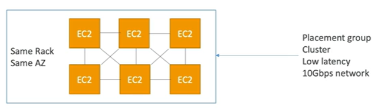

# High Performance Computing (HPC)

- The cloud is the perfect place to perform HPC
- You can create a very high number of resources in no time
- You can speed up time to results by adding more resources
- You can pay only for the systems you have used

Use Cases: Perform genomics, computational chemistry, financial risk modeling, weather prediction, machine learning, deep learning, autonomous driving

- Which services help manage HPC

## Data Management & Transfer

- AWS Direct Connect
- Snowball & Snowmobile
- AWS DataSync

## Compute & Network

- EC2 Instances
    - CPU optimized, GPU optimized
    - Spot Instances/Spot Fleets for cost savings + Auto Scaling
- EC2 Placement Groups: Cluster for good network performance

- EC2 Enhanced Networking (SR-IOV)
    - Higher bandwidth, higher PPS (packet per second), lower latency
    - Option 1: Elastic Network Adapter (ENA) up to 100 Gbps
    - Option 2: Intel 82599 VF interface (10 Gbps) - Legacy
- Elastic Fabric Adapter (EFA)
    - Improved ENA for HPC, only works for Linux
    - Great for inter-node communications, tightly coupled workloads
    - Leveraging Message Passing Interface (MPI) standard
    - Bypasses the kernel, low latency, low jitter, reliable transport

## Storage

- Instance-attached storage:
    - EBS: scale up to 256K IOPS with io2 block express
    - Instance Store: scale to millions of IOPS, linked to EC2 instance lifecycle, low latency, high throughput

- Network storage:
    - S3
    - EFS: scale IOPS based on total size, or use provisioned IOPS
    - FSx for Lustre
        - HPC  optimized distributed file system, millions of IOPS, sub-ms latencies
        - Backed by S3
    
## Automation and Orchestration

- AWS Batch
    - AWS Batch supports multi-node parallel jobs, which enables you to run a single jobs that spans multiple EC2 instances
    - Easily schedule jobs and launch EC2 instances accordingly

- AWS ParallelCluster
    - Open source cluster management tool that makes it easy to deploy and manage HPC clusters on AWS
    - Configure with text files
    - Automate create of VPC, subnet, cluster type and instance types
    - Ability to enable **EFA on the cluster** (improves network performance)
