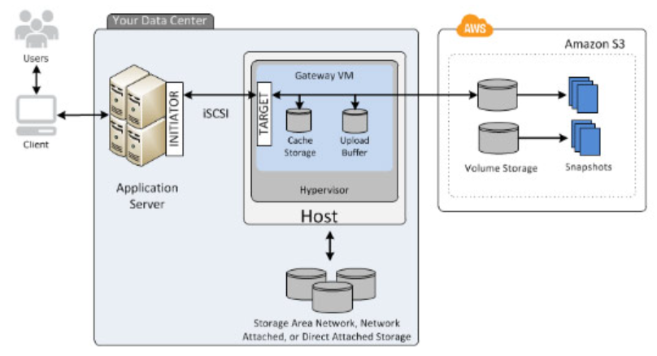

# EC2 Storage Gateway

- Enables hybrid cloud storage between on-premises environments and the AWS Cloud
- Integrates on-premise entepries applications and workflows with Amazon's block and object storage services through industry standard storage protocols
- Stores files as native S3 objects, archives virtual tapes in Amazon Glacier, and stores EBS snapshots generated by the Volume gateway with Amazon EBS

## File Gateway

- Presents a file interface to your applications, storing files as objects in Amazon S3 buckets, accessed through a  mount point

## Volume Gateway

- Provides cloud-backed storage volumes that you can mount as Internet Small Computer System Interface (iSCSI) devices from your on-premise application servers

- Supports the following volume types:
    - Cached Volumes - stores your data in Amazon S3 and retains a copy of frequently accessed data subsets locally
    
    - Stored Volumes - stores your primary data locally, while asynchronously backing up that data to AWS
    

## Tape Gateway

- Enables you to replace physical tapes on-premise with virtual tapes in AWS without changing existing backup workflows
- Supports leading backup applications and caches virtual tapes on-premise for low-latency data access
- Can move your virtual tapes archived in Amazon S3 Glacier or S3 Glacier Deep Archive (Note: You can move data into any storage tier)

## References

https://tutorialsdojo.com/aws-storage-gateway/
