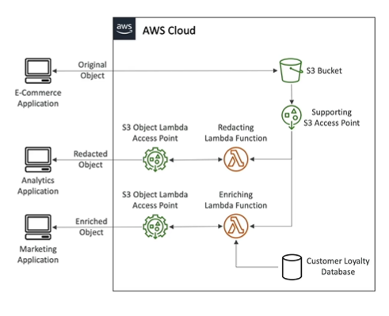

# S3 Object Lambda

- Use AWS Lamba Functions to modify the data returned by an S3 GET request
- Only one S3 bucket is needed, on top of which we create S3 Object Lambda Access Points
- Use Cases
    - Redacting sensitive data
    - Converting across data formats, such as converting CSV to JSON
    - Resizing and watermarking images on the fly using caller-specific details, such as a user who requested the object

    